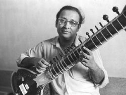
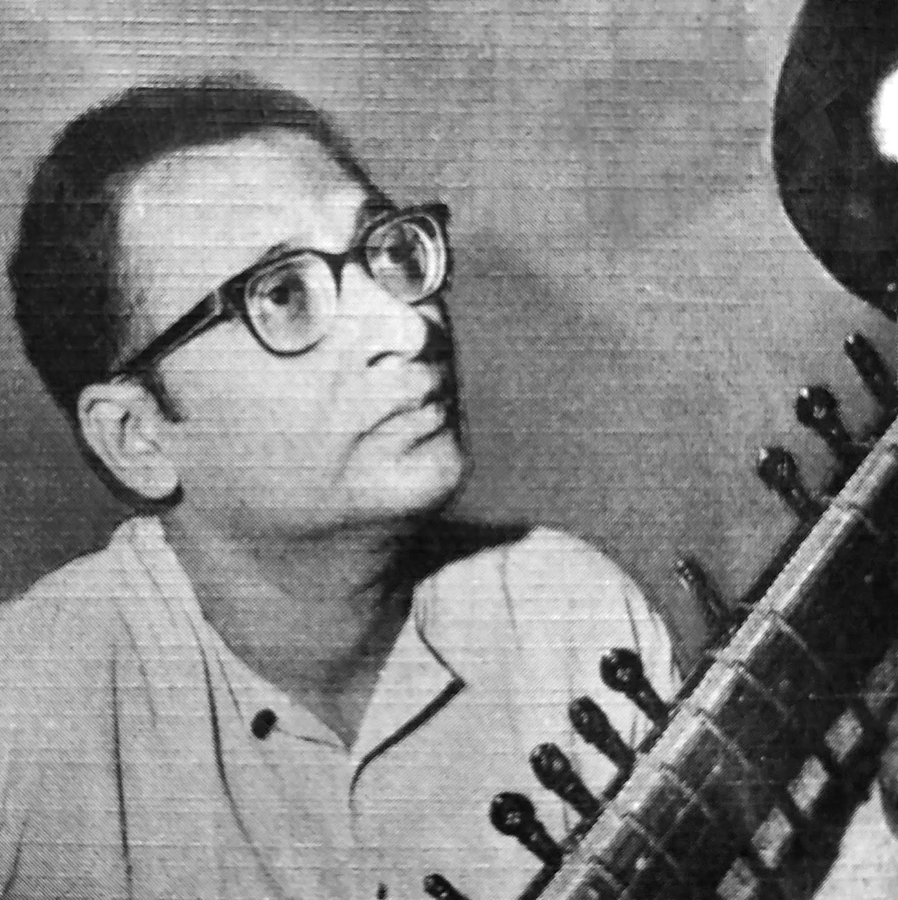
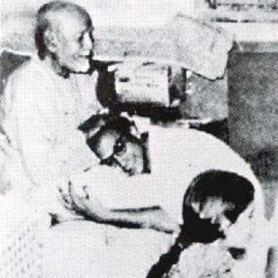
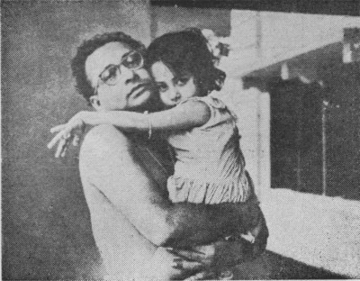

# Pandit Nikhil Banerjee (1931 - 1986)

> "...it is said that first your heart sings, then you play. I think if it is not like that, then it is only just a combination of notes, isn't it? " - Nikhil Banerjee

{: .note }
> We just aggregate web content links related to the artist and do not aim to claim ownership of any records. It is possible that a few weblinks become stale, or are removed by respective owners

## Contents
1. [Classical Records](#1-classical-records)
2. [Other Records](#2-other-records)
3. [Interviews and Discussions](#3-interviews-and-discussions)
4. [Teaching](#4-teaching)
5. [Documentaries](#4-documentaries)

---

<figure>
  
  <figcaption><i>Pandit Nikhil Banerjee with his Sitar Image</i></figcaption>
   
</figure>

<figure>
  
  <figcaption><i>Pandit Nikhil Banerjee in his young age</i></figcaption>
   
</figure>

<figure>
  
  <figcaption><i>Pandit Nikhil Banerjee with his guru Baba Allauddin Khan</i></figcaption>
</figure>

<figure>
  
  <figcaption><i>Pandit Nikhil Banerjee with his daughter</i></figcaption>
</figure>

## 1. Classical Records

*(Scroll left or right to view all columns of the table)*

| Index | Raag                | Record                                                         | About Record (Year, Place, Live)                      | Accompaniments                                                                        |
| ----- | ------------------- | -------------------------------------------------------------- | ----------------------------------------------------- | ------------------------------------------------------------------------------------- |
| 1     | Pahadi Manjh        | [Youtube](https://www.youtube.com/watch?v=Am9oHqDVb00)         |                                                       | Sarod: Ustad Ali Akbar Khan                                                           |
| 2     | Abhogi              | [Youtube](https://www.youtube.com/watch?v=0IXxpAZnbTM)         |                                                       |                                                                                       |
| 3     | Abhogi              | [Youtube](https://www.youtube.com/watch?v=dL8F1_pduY8)         | 1976                                                  | Tabla: Ustad Zakir Hussain                                                            |
| 4     | Abhogi              | [Youtube](https://www.youtube.com/watch?v=W3I3Nqfnofg)         | Stockholm                                             | Tabla: Pandit Anindo Chaterjee                                                        |
| 5     | Abhogi              | [Youtube](https://www.youtube.com/watch?v=RRlfbIgAESc)         |                                                       |                                                                                       |
| 6     | Adana               | [Youtube](https://www.youtube.com/watch?v=Hh3a-iLQs5M)         |                                                       | Tabla: Pandit Kishan Maharaj                                                          |
| 7     | Adana               | [Youtube](https://www.youtube.com/watch?v=BghRza-uSuE)         |                                                       |                                                                                       |
| 8     | Adana               | [Youtube](https://www.youtube.com/watch?v=_-6FTLgR9bo)         |                                                       |                                                                                       |
| 9     | Adana               | [Youtube](https://www.youtube.com/watch?v=oVqeP3Pm840)         |                                                       |                                                                                       |
| 10    | Ahir Bhairav        | [Youtube](https://www.youtube.com/watch?v=5KNq8pZS-ak)         | 1970; Amsterdam;                                      | Tabla: Pandit Kanai Dutt                                                              |
| 11    | Ahir Bhairav        | [Youtube](https://www.youtube.com/watch?v=_g6sMJa6Hk8)         |                                                       |                                                                                       |
| 12    | Ahir Bhairav        | [Youtube](https://www.youtube.com/watch?v=ybi-R32f430)         |                                                       | Tabla: Pt. Swapan Choudhury                                                           |
| 13    | Ahiri               | [Youtube](https://www.youtube.com/watch?v=RbV-83Ns4C0)         |                                                       |                                                                                       |
| 14    | Asavari             | [Youtube](https://www.youtube.com/watch?v=ol9FlMntTwk)         |                                                       | Tabla: Pandit Kanai Dutt                                                              |
| 15    | Asavari             | [Youtube](https://www.youtube.com/watch?v=c4QxNGeeDwQ)         |                                                       |                                                                                       |
| 16    | Bageshree           | [Youtube](https://www.youtube.com/watch?v=OnOqFDmmXCg)         |                                                       | Tabla: Ustad Fayyaz Ahmed Khan                                                        |
| 17    | Bageshri            | [Youtube](https://www.youtube.com/watch?v=EoVQbmQKMME)         |                                                       |                                                                                       |
| 18    | Bairagi             | [Youtube](https://www.youtube.com/watch?v=hIhePsHkyak)         |                                                       | Tabla: Pandit Shankar Ghosh                                                           |
| 19    | Bairagi             | [Youtube](https://www.youtube.com/watch?v=UG_U6Iwa15U)         |                                                       |                                                                                       |
| 20    | Basantmukhari       | [Youtube](https://www.youtube.com/watch?v=DUYx3UzNVjw)         |                                                       |                                                                                       |
| 21    | Bhairav             | [Youtube](https://www.youtube.com/watch?v=r4KI5X-HFUU&t=3471s) |                                                       |
| 22    | Bhairav             | [Youtube](https://www.youtube.com/watch?v=Aon82yuOpfU)         |                                                       |                                                                                       |
| 23    | Bhairav             | [Youtube](https://www.youtube.com/watch?v=RMZwF8gAA5o)         |                                                       |                                                                                       |
| 24    | Bhairav             | [Youtube](https://www.youtube.com/watch?v=pQ_mW5ELiyg)         |                                                       |                                                                                       |
| 25    | Bhairav             | [Youtube](https://www.youtube.com/watch?v=cDZrcBJC8oE)         | 1983; Dover Lane Music Conference, Kolkata            |                                                                                       |
| 26    | Bhairavi            | [Youtube](https://www.youtube.com/watch?v=dvF3MX5oli4)         | 1965                                                  |                                                                                       |
| 27    | Bhairavi            | [Youtube](https://www.youtube.com/watch?v=mnzny0o6QYE)         | Malhar Festival in memory of Baba Alauddin Khan Saheb | Sarod: Ustad Dhianesh Khan; Tabla: Pandit Kishan Maharaj; Sarod: Ustad Ali Akbar Khan |
| 28    | Bhairavi            | [Youtube](https://www.youtube.com/watch?v=KqMS6ecvlyU)         |                                                       |                                                                                       |
| 29    | Bhairavi            | [Youtube](https://www.youtube.com/watch?v=iEgG2zirb5U)         |                                                       | Tabla: Pandit Nikhil Ghosh                                                            |
| 30    | Bhairavi            | [Youtube](https://www.youtube.com/watch?v=S8picFTwo8A)         |                                                       |                                                                                       |
| 31    | Bhairavi            | [Youtube](https://www.youtube.com/watch?v=Rs2ZI7BVO0c)         |                                                       |                                                                                       |
| 32    | Bhairavi            | [Youtube](https://www.youtube.com/watch?v=28XbECR0RCY)         | 1978; Maihar Festival                                 | Sarod: Ustad Ali Akbar Khan                                                           |
| 33    | Bhatiar             | [Youtube](https://www.youtube.com/watch?v=1VY3jSGQ0Eg)         |                                                       |                                                                                       |
| 34    | Bhatiyar            | [Youtube](https://www.youtube.com/watch?v=gPPZmV2029Y)         |                                                       |                                                                                       |
| 35    | Bhatiyar            | [Youtube](https://www.youtube.com/watch?v=AZUwDveNAa8)         |                                                       | Sarod: Allauddin Khan, Ali Akbar Khan, Aashish Khan; Tabla: Kanthe Maharaj            |
| 36    | Bhimpalashi         | [Youtube](https://www.youtube.com/watch?v=Mr6Qx65oZ94)         |                                                       |                                                                                       |
| 37    | Bhimpalashri        | [Youtube](https://www.youtube.com/watch?v=xh0LuGC7qO4)         |                                                       | Sarod: Ustad Ali Akbar Khan                                                           |
| 38    | Bhimpalasi          | [Youtube](https://www.youtube.com/watch?v=mGWLhjY1rBI)         | 1970; Rotterdam                                       |                                                                                       |
| 39    | Bhimpalasri         | [Youtube](https://www.youtube.com/watch?v=yLMHGjXxjl0)         | 1971; London                                          | Tabla: Ustad Faiyaz Khan                                                              |
| 40    | Bhimpilasi          | [Youtube](https://www.youtube.com/watch?v=0NpbSiQgVkA)         | 1970; Rotterdam                                       | Tabla: Pandit Kanai Dutta                                                             |
| 41    | Bhinna Shadaj       | [Youtube](https://www.youtube.com/watch?v=uEHnSh5stSk)         |                                                       |                                                                                       |
| 42    | Bhinna Shadaj       | [Youtube](https://www.youtube.com/watch?v=CTj1MysTYy4)         |                                                       | Tabla: Pandit Jnan Prakash Ghosh                                                      |
| 43    | Bhoop Kalyan        | [Youtube](https://www.youtube.com/watch?v=LzhlrX3hKZA&t=11s)   |                                                       |
| 44    | Bihag               | [Youtube](https://www.youtube.com/watch?v=ZAEgIAS6hYU)         | 1968; Delhi                                           |                                                                                       |
| 45    | Bihag               | [Youtube](https://www.youtube.com/watch?v=YY7BpN6d9B4)         |                                                       |                                                                                       |
| 46    | Bihag               | [Youtube](https://www.youtube.com/watch?v=PMziS2cuB10)         |                                                       |                                                                                       |
| 47    | Bihag               | [Youtube](https://www.youtube.com/watch?v=EWCoZfEcq74)         | Köln Germany                                          |                                                                                       |
| 48    | Bihag               | [Youtube](https://www.youtube.com/watch?v=BQGqxY-k4ZI)         | Benaras                                               |                                                                                       |
| 49    | Bihag               | [Youtube](https://www.youtube.com/watch?v=UGzO1_N_Y2k)         | Sangeet Research Academy                              |                                                                                       |
| 50    | Bilaskhani          | [Youtube](https://www.youtube.com/watch?v=_aZtZjzZHxw)         |                                                       |                                                                                       |
| 51    | Bilaskhani Todi     | [Youtube](https://www.youtube.com/watch?v=1JxVGSTdI_0)         | 1965; Mumbai                                          | Tabla: Pandit Nikhil Ghosh                                                            |
| 52    | Bilaskhani Todi     | [Youtube](https://www.youtube.com/watch?v=do1mMQfPw9Q)         | 1981; Vadodara                                        | Tabla: Pandit Anindo Chaterjee                                                        |
| 53    | Bilaskhani Todi     | [Youtube](https://www.youtube.com/watch?v=tZVdZeC51MU)         |                                                       | Tabla: Pandit Anindo Chaterjee                                                        |
| 54    | Bilaskhani Todi     | [Youtube](https://www.youtube.com/watch?v=6mngKGEV4w8)         |                                                       |                                                                                       |
| 55    | Binnashadja         | [Youtube](https://www.youtube.com/watch?v=kENssyYVaj0)         | 1970s; BBC Program                                    |                                                                                       |
| 56    | Chandni Kedar       | [Youtube](https://www.youtube.com/watch?v=Oe_pW_uDZ70)         |                                                       |                                                                                       |
| 57    | Chandra Kaushiki    | [Youtube](https://www.youtube.com/watch?v=XPI_HjzFUCA)         |                                                       |                                                                                       |
| 58    | Chandra Kaushiki    | [Youtube](https://www.youtube.com/watch?v=6uR8Z-JLKTA)         | 1984                                                  | Tabla: Pandit Nikhil Ghosh                                                            |
| 59    | Chandra Kaushiki    | [Youtube](https://www.youtube.com/watch?v=Eqr0j9gorL8)         |                                                       | Tabla: Pandit Nikhil Ghosh                                                            |
| 60    | Chandrakauns        | [Youtube](https://www.youtube.com/watch?v=dVtnlX0en18)         | 1967; Berkeley                                        | Tabla: Pandit Mahapurush Mishra                                                       |
| 61    | Chandrakauns        | [Youtube](https://www.youtube.com/watch?v=yJIALM6sKuQ)         |                                                       |                                                                                       |
| 62    | Chandrakauns        | [Youtube](https://www.youtube.com/watch?v=HZIYhgAtGHE)         |                                                       |                                                                                       |
| 63    | Chandrakaushiki     | [Youtube](https://www.youtube.com/watch?v=TTV0Lxn0bjs)         |                                                       |                                                                                       |
| 64    | Chandrakaushiki     | [Youtube](https://www.youtube.com/watch?v=TL0Yz3mfxJw)         |                                                       |                                                                                       |
| 65    | Chandranandan       | [Youtube](https://www.youtube.com/watch?v=u4oIs5iMWCM)         |                                                       |                                                                                       |
| 66    | Charukeshi          | [Youtube](https://www.youtube.com/watch?v=Azf0zi5PESw)         |                                                       |                                                                                       |
| 67    | Charukeshi          | [Youtube](https://www.youtube.com/watch?v=wFg6IXW-2Og)         | 1978; Montreal                                        | Tabla: Pandit Anindo Chaterjee                                                        |
| 68    | Charukeshi          | [Youtube](https://www.youtube.com/watch?v=a8HvfIYU03o)         |                                                       |                                                                                       |
| 69    | Chhayanat           | [Youtube](https://www.youtube.com/watch?v=iitbNvCEu74)         | 1969; Sadarang Music Conference                       |                                                                                       |
| 70    | Darbari             | [Youtube](https://www.youtube.com/watch?v=BghRza-uSuE)         |                                                       |                                                                                       |
| 71    | Darbari             | [Youtube](https://www.youtube.com/watch?v=f2oUU1dPwAY)         |                                                       |                                                                                       |
| 72    | Darbari             | [Youtube](https://www.youtube.com/watch?v=5Enhv5ldDls)         | 24th January 1986; Dover Lane Music Conference        |                                                                                       |
| 73    | Darbari             | [Youtube](https://www.youtube.com/watch?v=EUiDVRfYwmQ)         |                                                       |                                                                                       |
| 74    | Darbari             | [Youtube](https://www.youtube.com/watch?v=UGRf5ZOFfaI)         | 1\. 26. 1986 (Last Concert)                           |                                                                                       |
| 75    | Darbari             | [Youtube](https://www.youtube.com/watch?v=pVbQ5iE_BzM)         | Shriram Shankarlal Music Festival Delhi               |                                                                                       |
| 76    | Darbari             | [Youtube](https://www.youtube.com/watch?v=R_cgVTKozOg)         |                                                       |                                                                                       |
| 77    | Darbari Kanada      | [Youtube](https://www.youtube.com/watch?v=U0PIyNZ3vlU)         |                                                       |                                                                                       |
| 78    | Desh                | [Youtube](https://www.youtube.com/watch?v=TM6FzNWcWFc)         |                                                       | Tabla: Pandit Samta Prasad                                                            |
| 79    | Desh                | [Youtube](https://www.youtube.com/watch?v=G5B42fVjc9U&t=1101s) | San Francisco                                         | Tabla: Pandit Mahapurush Mishra                                                       |
| 80    | Desh                | [Youtube](https://www.youtube.com/watch?v=NEoOPVbwrv8)         |                                                       |                                                                                       |
| 81    | Desh                | [Youtube](https://www.youtube.com/watch?v=ONZd4NTu1eo)         | 1976; Zurich, Switzerland                             |                                                                                       |
| 82    | Desh                | [Youtube](https://www.youtube.com/watch?v=EPZ91dUdN_k)         |                                                       |                                                                                       |
| 83    | Desh                | [Youtube](https://www.youtube.com/watch?v=MGUZhEeGEaM)         |                                                       | Tabla: Pandit Mahapurush Mishra                                                       |
| 84    | Desh                | [Youtube](https://www.youtube.com/watch?v=EjjipGmVQgg)         | 1976; Zurich                                          | Tabla: Pandit Anindo Chaterjee                                                        |
| 85    | Desh                | [Youtube](https://www.youtube.com/watch?v=GTNuFmM-kQw)         | San Francisco; Live                                   | Tabla: Pandit Mahapurush Mishra                                                       |
| 86    | Desh                | [Youtube](https://www.youtube.com/watch?v=dZysLJWJCt0)         |                                                       | Tabla: Pandit Abhijit Banerjee                                                        |
| 87    | Desh                | [Youtube](https://www.youtube.com/watch?v=bSOOQkLuiD0)         |                                                       | Tabla: Pandit Mahapurush Mishra                                                       |
| 88    | Desh                | [Youtube](https://www.youtube.com/watch?v=yW66Q1bvtc8)         |                                                       | Tabla: Pandit Anindo Chaterjee                                                        |
| 89    | Desh                | [Youtube](https://www.youtube.com/watch?v=IU5zgZQCZp0)         |                                                       | Tabla: Pandit Anindo Chaterjee                                                        |
| 90    | Desh                | [Youtube](https://www.youtube.com/watch?v=ZatGoO26g0k)         | 1979; Stockholm; Live                                 | Tabla: Pandit Anindo Chaterjee                                                        |
| 91    | Desh Malhar         | [Youtube](https://www.youtube.com/watch?v=KuG1oTe_gWo)         |                                                       |                                                                                       |
| 92    | Desi                | [Youtube](https://www.youtube.com/watch?v=0RFxxbhq8o4)         | All India Radio                                       | Tabla: Ustad Karmatullah Khan                                                         |
| 93    | Durga               | [Youtube](https://www.youtube.com/watch?v=z9asN7RfPI0)         |                                                       |                                                                                       |
| 94    | Gara                | [Youtube](https://www.youtube.com/watch?v=M5BiEQ8rZqc)         |                                                       | Tabla: Pandit Anindo Chaterjee                                                        |
| 95    | Gara                | [Youtube](https://www.youtube.com/watch?v=A0Ho92NQGqM)         | 1978; Montreal                                        | Tabla: Pandit Anindo Chaterjee                                                        |
| 96    | Gara                | [Youtube](https://www.youtube.com/watch?v=U6YC4GDSWcc)         |                                                       |                                                                                       |
| 97    | Gaud Sarang         | [Youtube](https://www.youtube.com/watch?v=gG3gD9oRSSc&t=14s)   |                                                       |
| 98    | Gauri Manjari       | [Youtube](https://www.youtube.com/watch?v=LPba6OtYJqs)         |                                                       |                                                                                       |
| 99    | Gauri Manjari       | [Youtube](https://www.youtube.com/watch?v=J4xDH_nHCbA)         |                                                       |                                                                                       |
| 100   | Gaurimanjari        | [Youtube](https://www.youtube.com/watch?v=FieO2clwqGE)         |                                                       |                                                                                       |
| 101   | Gaurimanjari        | [Youtube](https://www.youtube.com/watch?v=cUyFAMylxck)         | All India Radio Kolkata                               |                                                                                       |
| 102   | Gavati              | [Youtube](https://www.youtube.com/watch?v=XWPWOxRcsPw)         |                                                       |                                                                                       |
| 103   | Gunji Kanada        | [Youtube](https://www.youtube.com/watch?v=rps1cI-rYQU)         | All India Radio Kolkata                               |                                                                                       |
| 104   | Gunji Kanada        | [Youtube](https://www.youtube.com/watch?v=1FDUYs7X8FA)         |                                                       |                                                                                       |
| 105   | Gunji Kanada        | [Youtube](https://www.youtube.com/watch?v=1FDUYs7X8FA)         |                                                       |                                                                                       |
| 106   | Hameer              | [Youtube](https://www.youtube.com/watch?v=eCRhEqSqJxM)         |                                                       |                                                                                       |
| 107   | Hameer              | [Youtube](https://www.youtube.com/watch?v=PMziS2cuB10)         |                                                       |                                                                                       |
| 108   | Hameer              | [Youtube](https://www.youtube.com/watch?v=bOvf6GPoZLU)         |                                                       |                                                                                       |
| 109   | Hamsadhwani         | [Youtube](https://www.youtube.com/watch?v=7lKkW0Nvjuo)         |                                                       |                                                                                       |
| 110   | Hamsadhwani         | [Youtube](https://www.youtube.com/watch?v=fg7dJPwjrzk)         |                                                       | Tabla: Pandit Shyamal Bose                                                            |
| 111   | Hamsadhwani         | [Youtube](https://www.youtube.com/watch?v=oc9X5sBgJgQ)         |                                                       | Tabla: Pandit Swapan Chaudhuri                                                        |
| 112   | Hamsadhwani         | [Youtube](https://www.youtube.com/watch?v=7lKkW0Nvjuo)         |                                                       |                                                                                       |
| 113   | Hansadhwani         | [Youtube](https://www.youtube.com/watch?v=BH0T2Qwh9hE)         |                                                       |                                                                                       |
| 114   | Hem                 | [Youtube](https://www.youtube.com/watch?v=d4V-P7iZnes)         |                                                       |                                                                                       |
| 115   | Hem Basant          | [Youtube](https://www.youtube.com/watch?v=hKshjjd5hC8)         |                                                       | Tabla: Ustad Zakir Hussain                                                            |
| 116   | Hem Basant          | [Youtube](https://www.youtube.com/watch?v=nYEfTI3m0k0)         |                                                       |                                                                                       |
| 117   | Hem Bihag           | [Youtube](https://www.youtube.com/watch?v=dR7BM_MQCN4)         |                                                       |                                                                                       |
| 118   | Hem Bihag           | [Youtube](https://www.youtube.com/watch?v=scgUleWwVjo)         |                                                       | Tabla - Ustad Zakir Hussain                                                           |
| 119   | Hem Hindol          | [Youtube](https://www.youtube.com/watch?v=puOaw9GwBJ0)         |                                                       | Tabla: Pandit Anindo Chaterjee                                                        |
| 120   | Hem Lalit           | [Youtube](https://www.youtube.com/watch?v=VJtHFws4dTA)         |                                                       | Tabla: Pandit Kishen Maharaj                                                          |
| 121   | Hem Lalit           | [Youtube](https://www.youtube.com/watch?v=DbDR2YIoE7g)         |                                                       | Tabla: Ustad Zamir Ahmed                                                              |
| 122   | Hemant              | [Youtube](https://www.youtube.com/watch?v=sCr9vFdkI7Y)         |                                                       | Tabla: Pandit Nikhil Ghosh                                                            |
| 123   | Hemant              | [Youtube](https://www.youtube.com/watch?v=4ekFUfhKKSU)         | 1961; Varanasi                                        | Sarod: Ustad Bahadur Khan                                                             |
| 124   | Hemant              | [Youtube](https://www.youtube.com/watch?v=H5QNGAa7Hfc)         | 1980; Park circus Music Conference                    | Tabla: Pandit Swapan Chaudhuri                                                        |
| 125   | Hemant              | [Youtube](https://www.youtube.com/watch?v=_2-wvi6YuUs)         |                                                       |                                                                                       |
| 126   | Hemant              | [Youtube](https://www.youtube.com/watch?v=5Enhv5ldDls)         | 24th January 1986; Dover Lane Music Conference        |                                                                                       |
| 127   | Hemant              | [Youtube](https://www.youtube.com/watch?v=RSO3oa5K8MY)         | Samta Prasad at Radio Sangeet Sammelan                |                                                                                       |
| 128   | Hindol Bahar        | [Youtube](https://www.youtube.com/watch?v=TcrCwUacxgg)         |                                                       |                                                                                       |
| 129   | Iman                | [Youtube](https://www.youtube.com/watch?v=Ksoj1I4hz-M)         |                                                       |                                                                                       |
| 130   | Jaijaiwanti         | [Youtube](https://www.youtube.com/watch?v=x2iJklU2EIo)         | 1980; UK                                              |                                                                                       |
| 131   | Jaijaiwanti         | [Youtube](https://www.youtube.com/watch?v=UJ3UwkK7Mm8&t=3443s) |                                                       |
| 132   | Jaijaiwanti         | [Youtube](https://www.youtube.com/watch?v=qu7zWQjIsUg)         |                                                       | Tabla: Ustad Faiyaz Khan                                                              |
| 133   | Jaijaiwanti         | [Youtube](https://www.youtube.com/watch?v=uHBiKIEZpgc)         |                                                       |                                                                                       |
| 134   | Jaijaiwanti         | [Youtube](https://www.youtube.com/watch?v=QBhsBo4Dy8o)         |                                                       |                                                                                       |
| 135   | Jaunpuri            | [Youtube](https://www.youtube.com/watch?v=xZkR8gH04_Y)         |                                                       |                                                                                       |
| 136   | Jaunpuri            | [Youtube](https://www.youtube.com/watch?v=gwIioHPtqA0)         |                                                       |                                                                                       |
| 137   | Jaunpuri            | [Youtube](https://www.youtube.com/watch?v=ZbK5di9ZZzM)         |                                                       | Tabla: Pandit Swapan Chaudhuri                                                        |
| 138   | Jhinjhoti           | [Youtube](https://www.youtube.com/watch?v=ppkkbxoNIPk)         |                                                       |                                                                                       |
| 139   | Jhinjhoti           | [Youtube](https://www.youtube.com/watch?v=0Z6FVtQrcq4)         |                                                       | Tabla: Pandit Anindo Chaterjee                                                        |
| 140   | Jhinjhoti           | [Youtube](https://www.youtube.com/watch?v=D9pK6nEel7g)         |                                                       |                                                                                       |
| 141   | Jhinjhoti           | [Youtube](https://www.youtube.com/watch?v=1q8FhIWjkoM)         |                                                       |                                                                                       |
| 142   | Jhinjhoti           | [Youtube](https://www.youtube.com/watch?v=Oq1RdHuPDSo)         | Wörgl, Austria                                        |                                                                                       |
| 143   | Jogiya Kalingra     | [Youtube](https://www.youtube.com/watch?v=WHbj4t9MMLs)         |                                                       | Sarod: Ustad Ali Akbar Khan                                                           |
| 144   | Jogkauns            | [Youtube](https://www.youtube.com/watch?v=_kBmv4IQ0Ic)         | 1975; California                                      | Tabla: Pandit Jnan Prakash Ghosh                                                      |
| 145   | Jogkauns            | [Youtube](https://www.youtube.com/watch?v=CgaR4GVnWUg)         |                                                       |                                                                                       |
| 146   | Jogkauns            | [Youtube](https://www.youtube.com/watch?v=_C7wPFXQavs)         |                                                       | Tabla: Pandit Jnan Prakash Ghosh                                                      |
| 147   | Kafi                | [Youtube](https://www.youtube.com/watch?v=TUtSBrGv7B8)         | 1975; Paris                                           |                                                                                       |
| 148   | Kafi                | [Youtube](https://www.youtube.com/watch?v=TJ6ihRxE31g)         |                                                       |                                                                                       |
| 149   | Kafi                | [Youtube](https://www.youtube.com/watch?v=dL8F1_pduY8)         | 1976                                                  | Tabla: Ustad Zakir Hussain                                                            |
| 150   | Kafi Sindhura       | [Youtube](https://www.youtube.com/watch?v=_m7jBG4THtg)         | BBC London Performance                                | Tabla: Pandit Swapan Chaudhuri                                                        |
| 151   | Kalashree           | [Youtube](https://www.youtube.com/watch?v=RbjwIkDcpjo)         |                                                       |                                                                                       |
| 152   | Kalashree           | [Youtube](https://www.youtube.com/watch?v=0U90pZCao9I)         |                                                       |                                                                                       |
| 153   | Kamod               | [Youtube](https://www.youtube.com/watch?v=o2I7Suce72M)         | 4th Feb 1984; Calcutta                                | Tabla: Pandit Shankar Gosh                                                            |
| 154   | Kamod               | [Youtube](https://www.youtube.com/watch?v=E0J1HvFMHRg)         |                                                       | Tabla: Pandit Shankar Gosh                                                            |
| 155   | Kaunsi Bhairav      | [Youtube](https://www.youtube.com/watch?v=dGkGDzCKo_s)         |                                                       |                                                                                       |
| 156   | Kaunsi Kannada      | [Youtube](https://www.youtube.com/watch?v=gBdFsUi4AjY)         | 31st Jan 1985; Benaras                                |                                                                                       |
| 157   | Kaunsi Kanra        | [Youtube](https://www.youtube.com/watch?v=dCW0X_8R8HI)         | 1964; Madras                                          |                                                                                       |
| 158   | Kaushi Kanada       | [Youtube](https://www.youtube.com/watch?v=XIeGWl0mdhg)         | 1985; Delhi                                           |                                                                                       |
| 159   | Kaushidhwani        | [Youtube](https://www.youtube.com/watch?v=tX8mqPSmjiM)         |                                                       |                                                                                       |
| 160   | Kaushik Bhairav     | [Youtube](https://www.youtube.com/watch?v=tmjhpx4omR0)         |                                                       |                                                                                       |
| 161   | Kaushik Bhairav     | [Youtube](https://www.youtube.com/watch?v=7yJ9OGELIWI)         |                                                       |                                                                                       |
| 162   | Kaushiki            | [Youtube](https://www.youtube.com/watch?v=WXawI9BzKyc)         |                                                       |                                                                                       |
| 163   | Kaushiki            | [Youtube](https://www.youtube.com/watch?v=LW8f0TsWFQQ)         | 1979; Nagpur                                          |                                                                                       |
| 164   | Kaushiki            | [Youtube](https://www.youtube.com/watch?v=Dm86CeHWLMw)         | 1977; Kolkata                                         | Tabla: Ustad Zakir Hussain                                                            |
| 165   | Kedar               | [Youtube](https://www.youtube.com/watch?v=pDMpMJpcYxc)         |                                                       |                                                                                       |
| 166   | Kedar               | [Youtube](https://www.youtube.com/watch?v=CzNb97ds0e4)         |                                                       | Tabla: Pandit Anindo Chaterjee                                                        |
| 167   | Kedar               | [Youtube](https://www.youtube.com/watch?v=9qa8pYE9MRs)         |                                                       |                                                                                       |
| 168   | Keerwani            | [Youtube](https://www.youtube.com/watch?v=_8AtqWFGm_A)         | 1970s; Jamshedpur                                     |                                                                                       |
| 169   | Khamaj              | [Youtube](https://www.youtube.com/watch?v=hrIomkZ5y2E)         |                                                       | Tabla: Pandit Shyamal Bose                                                            |
| 170   | Khamaj              | [Youtube](https://www.youtube.com/watch?v=1Af2v9_dYy0)         |                                                       | Tabla: Pandit Swapan Chaudhuri                                                        |
| 171   | Khamaj              | [Youtube](https://www.youtube.com/watch?v=4iVJoL6jwD0)         |                                                       | Tabla: Ustad Zakir Hussain                                                            |
| 172   | Khamaj              | [Youtube](https://www.youtube.com/watch?v=gixJMEb56gw)         | Köln Germany                                          |                                                                                       |
| 173   | Khamaj              | [Youtube](https://www.youtube.com/watch?v=EWmbMnDwi6s)         | 1967; Berkeley (U.S.A.)                               | Tabla: Pandit Mahapurush Mishra                                                       |
| 174   | Khamaj              | [Youtube](https://www.youtube.com/watch?v=k1HTOJ-qhq0)         | San Rafael; Live                                      | Tabla: Pandit Swapan Chaudhuri                                                        |
| 175   | Khamaj              | [Youtube](https://www.youtube.com/watch?v=WxbJSkyjSMA)         |                                                       | Tabla: Ustad Zakir Hussain                                                            |
| 176   | Khamaj              | [Youtube](https://www.youtube.com/watch?v=7tByVguBksA)         |                                                       |                                                                                       |
| 177   | Khamaj              | [Youtube](https://www.youtube.com/watch?v=rNxEeCRTNwQ)         |                                                       |                                                                                       |
| 178   | Khamaj Gat          | [Youtube](https://www.youtube.com/watch?v=5QGSYG8dIQo)         |                                                       | Tabla: Pandit Kishan Maharaj                                                          |
| 179   | Kirwani             | [Youtube](https://www.youtube.com/watch?v=2ZxHd94qj0M)         |                                                       | Tabla: Pandit Swapan Chaudhuri                                                        |
| 180   | Kirwani             | [Youtube](https://www.youtube.com/watch?v=mMsR-f0APXk)         |                                                       | Tabla: Pandit Anindo Chatterjee                                                       |
| 181   | Kirwani             | [Youtube](https://www.youtube.com/watch?v=d3xejzuZPYs)         |                                                       | Tabla: Pandit Anindo Chaterjee                                                        |
| 182   | Kirwani             | [Youtube](https://www.youtube.com/watch?v=50Ulsgol8fg)         |                                                       | Sarod: Ustad Ali Akbar Khan                                                           |
| 183   | Kirwani             | [Youtube](https://www.youtube.com/watch?v=aYUx87UQqoQ)         | Shriram Shankarlal Music Festival Delhi               |                                                                                       |
| 184   | Lalit               | [Youtube](https://www.youtube.com/watch?v=o6-prIn3W0g)         |                                                       |                                                                                       |
| 185   | Lalit               | [Youtube](https://www.youtube.com/watch?v=d4V-P7iZnes)         |                                                       |                                                                                       |
| 186   | Lalit               | [Youtube](https://www.youtube.com/watch?v=Xo6oXSSLlhE)         |                                                       | Tabla: Pandit Shamta Prasad                                                           |
| 187   | Lalit Bhankar       | [Youtube](https://www.youtube.com/watch?v=HZIveeWEoaE)         |                                                       |                                                                                       |
| 188   | Lalit Bhankar       | [Youtube](https://www.youtube.com/watch?v=zTtvmMI7Prs)         |                                                       | Sarod: Ustad Ali Akbar Khan                                                           |
| 189   | Lalit Pancham       | [Youtube](https://www.youtube.com/watch?v=zTtvmMI7Prs)         |                                                       | Sarod: Ustad Ali Akbar Khan                                                           |
| 190   | Lalit Pancham       | [Youtube](https://www.youtube.com/watch?v=XykPP_zY57U)         |                                                       |                                                                                       |
| 191   | Lalit Pancham       | [Youtube](https://www.youtube.com/watch?v=FljffutuDJY)         | 1970s; Kolkata                                        |                                                                                       |
| 192   | Lalita Gauri        | [Youtube](https://www.youtube.com/watch?v=pZePfLvSu-4)         | 1975; Paris 13th November                             |                                                                                       |
| 193   | Lalita Gauri        | [Youtube](https://www.youtube.com/watch?v=eRKiewtkDXg)         |                                                       |                                                                                       |
| 194   | Lalita Gauri        | [Youtube](https://www.youtube.com/watch?v=2zK76EYK6wA)         |                                                       |                                                                                       |
| 195   | Latangi             | [Youtube](https://www.youtube.com/watch?v=LAOxKBV8IkI)         |                                                       |                                                                                       |
| 196   | Madhmad Sarang      | [Youtube](https://www.youtube.com/watch?v=jEkVjFGtjg8)         |                                                       |                                                                                       |
| 197   | Madhmad Sarang      | [Youtube](https://www.youtube.com/watch?v=kjUZzGNqm5g)         |                                                       |                                                                                       |
| 198   | Madhmad Sarang      | [Youtube](https://www.youtube.com/watch?v=_D0rzZjkEKM)         |                                                       |                                                                                       |
| 199   | Malayalam Smruti    | [Youtube](https://www.youtube.com/watch?v=mnzny0o6QYE)         | Malhar Festival in memory of Baba Alauddin Khan Saheb | Sarod: Ustad Dhianesh Khan; Tabla: Pandit Kishan Maharaj; Sarod: Ustad Ali Akbar Khan |
| 200   | Malayam Smruti      | [Youtube](https://www.youtube.com/watch?v=wq_xoPM9Bzk)         | 1978; Maihar Festival                                 | Sarod: Ustad Ali Akbar Khan                                                           |
| 201   | Malgunji            | [Youtube](https://www.youtube.com/watch?v=iz0KoCn6sb0)         | 1980; Munich                                          |                                                                                       |
| 202   | Malgunji            | [Youtube](https://www.youtube.com/watch?v=borqRSf5y18)         | 1981; Munich                                          |                                                                                       |
| 203   | Malgunji            | [Youtube](https://www.youtube.com/watch?v=e2n7dS2OD6g)         | 1982; Munich                                          |                                                                                       |
| 204   | Malgunji            | [Youtube](https://www.youtube.com/watch?v=LICJW9Be20s)         | 1983; Munich                                          |                                                                                       |
| 205   | Malgunji            | [Youtube](https://www.youtube.com/watch?v=P_gOnEoIny0)         | 1984; Munich                                          |                                                                                       |
| 206   | Malgunji            | [Youtube](https://www.youtube.com/watch?v=-TaVe8vsrAE)         |                                                       |                                                                                       |
| 207   | Malgunji            | [Youtube](https://www.youtube.com/watch?v=PKr4rZUjr08)         | 1980; Munich                                          | Tabla: Pandit Anindo Chaterjee                                                        |
| 208   | Malgunji            | [Youtube](https://www.youtube.com/watch?v=OuLBZHjSj14)         |                                                       |                                                                                       |
| 209   | Malkauns            | [Youtube](https://www.youtube.com/watch?v=ssO9fHiDJrg)         |                                                       | Tabla: Ustad Faiyaz Khan                                                              |
| 210   | Malkauns            | [Youtube](https://www.youtube.com/watch?v=oyCMUAt4bw4)         |                                                       | Tabla: Pandit Anindo Chaterjee                                                        |
| 211   | Malkauns            | [Youtube](https://www.youtube.com/watch?v=nGBxsvrxu4Y)         |                                                       | Tabla: Ustad Faiyaj Khan                                                              |
| 212   | Malkauns            | [Youtube](https://www.youtube.com/watch?v=aXa7ZuQuAZc)         |                                                       | Tabla: Pandit Sameer Chatterjee                                                       |
| 213   | Malkauns            | [Youtube](https://www.youtube.com/watch?v=H4vQqQ__5SI)         |                                                       | Tabla: Pandit Samir Chatterjee                                                        |
| 214   | Malkauns            | [Youtube](https://www.youtube.com/watch?v=jdoWx7F9uzQ)         |                                                       |                                                                                       |
| 215   | Malkauns            | [Youtube](https://www.youtube.com/watch?v=0wukDeb0ThY)         |                                                       |                                                                                       |
| 216   | Malkauns            | [Youtube](https://www.youtube.com/watch?v=nMSYzYlNsxw)         |                                                       | Tabla: Pandit Anindo Chaterjee                                                        |
| 217   | Malkauns            | [Youtube](https://www.youtube.com/watch?v=fgoajYsgYF4)         |                                                       |                                                                                       |
| 218   | Maluha Kalyan       | [Youtube](https://www.youtube.com/watch?v=YdASkBubYqA)         |                                                       | Tabla: Pandit Kumar Bose                                                              |
| 219   | Maluha Kalyan       | [Youtube](https://www.youtube.com/watch?v=zLZIMDdsbU0)         |                                                       | Tabla: Pandit Swapan Chaudhuri                                                        |
| 220   | Maluha Kalyan       | [Youtube](https://www.youtube.com/watch?v=hdjGjmdmHNI)         |                                                       |                                                                                       |
| 221   | Maluha Kalyan       | [Youtube](https://www.youtube.com/watch?v=uIwmAAmkCUQ)         |                                                       | Tabla: Pandit Anindo Chaterjee                                                        |
| 222   | Maluha Kalyan       | [Youtube](https://www.youtube.com/watch?v=7v0YB6twMlk)         |                                                       | Tabla: Pandit Anindo Chaterjee                                                        |
| 223   | Maluha Kalyan       | [Youtube](https://www.youtube.com/watch?v=GfnTIh4DAV8)         |                                                       | Tabla: Pandit Anindo Chaterjee                                                        |
| 224   | Manamanjari         | [Youtube](https://www.youtube.com/watch?v=SD2ikq5g7hU)         |                                                       |                                                                                       |
| 225   | Manamanjari         | [Youtube](https://www.youtube.com/watch?v=6H6vFpPmSdg)         |                                                       |                                                                                       |
| 226   | Manamanjari         | [Youtube](https://www.youtube.com/watch?v=sGsNwR4zUA4)         |                                                       |                                                                                       |
| 227   | Manamanjari         | [Youtube](https://www.youtube.com/watch?v=f3qS9kQ09bw)         |                                                       |                                                                                       |
| 228   | Manj Khamaj         | [Youtube](https://www.youtube.com/watch?v=4ekFUfhKKSU)         | 1961; Varanasi                                        | Sarod: Ustad Bahadur Khan                                                             |
| 229   | Manj Khamaj         | [Youtube](https://www.youtube.com/watch?v=1I33pnrxcKg)         |                                                       |                                                                                       |
| 230   | Manj Khamaj         | [Youtube](https://www.youtube.com/watch?v=W2WoWy877r4)         |                                                       | Tabla: Pandit Anindo Chaterjee                                                        |
| 231   | Manj Khamaj         | [Youtube](https://www.youtube.com/watch?v=XSone_90wIk)         |                                                       |                                                                                       |
| 232   | Manj Khammaj        | [Youtube](https://www.youtube.com/watch?v=p1LfqxSbRgQ)         |                                                       | Tabla: Pandit Mahapurush Misra                                                        |
| 233   | Manjh Khamaj        | [Youtube](https://www.youtube.com/watch?v=MTldNo_AwL4)         |                                                       |                                                                                       |
| 234   | Manjh Khamaj        | [Youtube](https://www.youtube.com/watch?v=8MGbe6xR3_w)         |                                                       |                                                                                       |
| 235   | Manjh Khamaj        | [Youtube](https://www.youtube.com/watch?v=i2fKtCohri4)         |                                                       | Sarod: Ustad Ali Akbar Khan                                                           |
| 236   | Manjh Khamaj        | [Youtube](https://www.youtube.com/watch?v=kVFNpTm35GU)         |                                                       | Tabla: Pandit Kishan Maharaj                                                          |
| 237   | Manjh Khamaj        | [Youtube](https://www.youtube.com/watch?v=nGBxsvrxu4Y)         |                                                       | Tabla: Ustad Faiyaz Khan                                                              |
| 238   | Manomanjari         | [Youtube](https://www.youtube.com/watch?v=YtqV4lnqEec)         |                                                       |                                                                                       |
| 239   | Manomanjari         | [Youtube](https://www.youtube.com/watch?v=C4VaaH_uxhg)         | 1968; Live in Berkeley (USA)                          |                                                                                       |
| 240   | Maru Bihag          | [Youtube](https://www.youtube.com/watch?v=3Oa6cO57gfE)         | 14 November 1981; Rang Bhavan Bombay                  |                                                                                       |
| 241   | Maru Bihag          | [Youtube](https://www.youtube.com/watch?v=74s35eFxqxc)         | 1982; Delhi                                           |                                                                                       |
| 242   | Maru Bihag          | [Youtube](https://www.youtube.com/watch?v=n27HYmcOUcg)         |                                                       | Tabla: Pandit Anindo Chaterjee                                                        |
| 243   | Maru Bihag          | [Youtube](https://www.youtube.com/watch?v=6K4l0rOJcPA)         |                                                       | Tabla: Pandit Shyamal Bose                                                            |
| 244   | Maru Bihag          | [Youtube](https://www.youtube.com/watch?v=WbRK1G-ewKc)         |                                                       |                                                                                       |
| 245   | Maru Bihag          | [Youtube](https://www.youtube.com/watch?v=iHxnL3YzR7A)         |                                                       | Tabla: Pandit Anindo Chaterjee                                                        |
| 246   | Maru Bihag          | [Youtube](https://www.youtube.com/watch?v=-h7uP_euv0g)         | 1980; UK                                              | Tabla: Pandit Anindo Chaterjee                                                        |
| 247   | Maru Bihag          | [Youtube](https://www.youtube.com/watch?v=lsRmoP8s_uM)         |                                                       |                                                                                       |
| 248   | Marwa               | [Youtube](https://www.youtube.com/watch?v=eBdinGG6dUM)         |                                                       |                                                                                       |
| 249   | Marwa               | [Youtube](https://www.youtube.com/watch?v=gDzBxkMwHu8)         |                                                       | Tabla: Pandit Swapan Chaudhury                                                        |
| 250   | Marwa               | [Youtube](https://www.youtube.com/watch?v=c_iYrMHHxzk)         |                                                       | Tabla: Ustad Zakir Hussain                                                            |
| 251   | Megh                | [Youtube](https://www.youtube.com/watch?v=MNgkMvLv7_4)         |                                                       | Tabla: Pandit Swapan Chaudhury                                                        |
| 252   | Megh                | [Youtube](https://www.youtube.com/watch?v=OKqvNoGOaw0)         |                                                       |                                                                                       |
| 253   | Megh                | [Youtube](https://www.youtube.com/watch?v=jC3Gh5jUaxw)         |                                                       |                                                                                       |
| 254   | Mishra Bhairavi     | [Youtube](https://www.youtube.com/watch?v=Azf0zi5PESw)         |                                                       |                                                                                       |
| 255   | Mishra Kafi         | [Youtube](https://www.youtube.com/watch?v=HF2WDfE210Q)         |                                                       | Swapan Choudhury: Tabla                                                               |
| 256   | Mishra Kafi         | [Youtube](https://www.youtube.com/watch?v=M5BiEQ8rZqc)         |                                                       | Tabla: Pandit Anindo Chaterjee                                                        |
| 257   | Mishra Kafi         | [Youtube](https://www.youtube.com/watch?v=meH3KNPqBpg)         |                                                       | Tabla: Pandit Swapan Choudhury                                                        |
| 258   | Mishra Kafi         | [Youtube](https://www.youtube.com/watch?v=lQm02TyULuE)         |                                                       |                                                                                       |
| 259   | Mishra Khamaj       | [Youtube](https://www.youtube.com/watch?v=BiqkONtxvfQ)         | AIR Calcutta                                          | Tabla: Pandit Shyamal Bose                                                            |
| 260   | Mishra Khamaj       | [Youtube](https://www.youtube.com/watch?v=ud8Kk0eMHy4)         |                                                       | Tabla: Pandit Anindo Chaterjee                                                        |
| 261   | Mishra Khamaj       | [Youtube](https://www.youtube.com/watch?v=gDzBxkMwHu8)         | Swapan Chaudhuri                                      |                                                                                       |
| 262   | Mishra Khamaj       | [Youtube](https://www.youtube.com/watch?v=dZysLJWJCt0)         |                                                       | Tabla: Pandit Abhijit Banerjee                                                        |
| 263   | Mishra Khamaj       | [Youtube](https://www.youtube.com/watch?v=vpQmHHRh_Cc)         | December 15 1984; Kolkata                             |                                                                                       |
| 264   | Mishra Khamaj       | [Youtube](https://www.youtube.com/watch?v=uLtt1AtFsAY)         |                                                       | Tabla: Pandit Jnan Prakash Ghosh                                                      |
| 265   | Mishra Khamaj       | [Youtube](https://www.youtube.com/watch?v=SJashDlY1Q0)         |                                                       | Tabla: Pandit Anindo Chaterjee                                                        |
| 266   | Mishra Mand         | [Youtube](https://www.youtube.com/watch?v=OramiL9_9Ok)         | AIR Calcutta                                          | Tabla: Ustad Keramatullah Khan                                                        |
| 267   | Mishra Mand         | [Youtube](https://www.youtube.com/watch?v=O7aXeJNmvww)         |                                                       | Tabla: Pandit Mahapurush Misra                                                        |
| 268   | Mishra Pahadi       | [Youtube](https://www.youtube.com/watch?v=XLb9NU-Iq28)         |                                                       | Tabla: Pandit Shankar Ghosh                                                           |
| 269   | Mishra Pilu         | [Youtube](https://www.youtube.com/watch?v=Azf0zi5PESw)         |                                                       |                                                                                       |
| 270   | Mishra Pilu         | [Youtube](https://www.youtube.com/watch?v=M5BiEQ8rZqc)         |                                                       | Tabla: Pandit Anindo Chaterjee                                                        |
| 271   | Mishra Shivaranjani | [Youtube](https://www.youtube.com/watch?v=bcuFSwTSOGM)         |                                                       | Tabla: Pandit Abhijit Banerjee                                                        |
| 272   | Mishra Shivaranjani | [Youtube](https://www.youtube.com/watch?v=F718CiETlH4)         |                                                       | Tabla: Pandit Anindo Chaterjee                                                        |
| 273   | Mishra Shivaranjani | [Youtube](https://www.youtube.com/watch?v=74s35eFxqxc)         | 1982; Delhi                                           |                                                                                       |
| 274   | Mishra Shivaranjani | [Youtube](https://www.youtube.com/watch?v=mMsR-f0APXk)         |                                                       | Tabla: Pandit Anindo Chaterjee                                                        |
| 275   | Mishra Shivaranjani | [Youtube](https://www.youtube.com/watch?v=U-FQaTh3fHw)         |                                                       | Tabla: Pandit Anindo Chaterjee                                                        |
| 276   | Mishra Shivranjani  | [Youtube](https://www.youtube.com/watch?v=Fx0CGyFa18M)         | 1980; Pilani                                          | Tabla: Pandit Anindo Chaterjee                                                        |
| 277   | Mishra Shivranjani  | [Youtube](https://www.youtube.com/watch?v=O6tkIE8hZeY)         |                                                       |                                                                                       |
| 278   | Mishra Shivranjani  | [Youtube](https://www.youtube.com/watch?v=QxQWOqFgiRs)         |                                                       |                                                                                       |
| 279   | Mishra Shivranjini  | [Youtube](https://www.youtube.com/watch?v=0lJWwqXo6dY)         | 1982; BITS Pilani                                     | Tabla: Pandit Anindo Chaterjee                                                        |
| 280   | Mishra Tilong       | [Youtube](https://www.youtube.com/watch?v=nyqhJUAK9Ns)         |                                                       | Tabla: Pandit Anindo Chaterjee                                                        |
| 281   | Misra Mand          | [Youtube](https://www.youtube.com/watch?v=jZ9BPAqKfCc)         |                                                       | Sarod: Ustad Ali Akbar Khan; Tabla: Pandit Mahapurush Misra                           |
| 282   | Miyan ki Malhar     | [Youtube](https://www.youtube.com/watch?v=u1UX9Hac0CI)         |                                                       |                                                                                       |
| 283   | Miyan Ki Malhar     | [Youtube](https://www.youtube.com/watch?v=4CMmko2YNyE)         |                                                       |                                                                                       |
| 284   | Miyan Ki Malhar     | [Youtube](https://www.youtube.com/watch?v=HZvxSXfvNOs&t=29s)   | 1960s; AIR Kolkata                                    |                                                                                       |
| 285   | Miyan Ki Todi       | [Youtube](https://www.youtube.com/watch?v=BL4UQEq7aio)         | Kolkata                                               |                                                                                       |
| 286   | Miyan Ki Todi       | [Youtube](https://www.youtube.com/watch?v=U16iq-xfM3Y)         |                                                       |                                                                                       |
| 287   | Multani             | [Youtube](https://www.youtube.com/watch?v=iM2tkoR-nng)         |                                                       |                                                                                       |
| 288   | Multani             | [Youtube](https://www.youtube.com/watch?v=wviIX8BLqzE)         |                                                       | Tabla: Ustad Fayaz Khan                                                               |
| 289   | Nand Kalyan         | [Youtube](https://www.youtube.com/watch?v=2fH39ku1E8E)         | 2nd February 1976; Kala Mandir                        | Tabla: Pandit Anindo Chaterjee                                                        |
| 290   | Nat Bhairav         | [Youtube](https://www.youtube.com/watch?v=c1ZwsEaCyyM)         |                                                       |                                                                                       |
| 291   | Nat Bhairav         | [Youtube](https://www.youtube.com/watch?v=qE0Jhl4r66w)         | 1984; BBC Program                                     | Tabla: Pandit Anindo Chaterjee                                                        |
| 292   | Pahadi              | [Youtube](https://www.youtube.com/watch?v=_Ps67MamLeM)         | 1978; Zurich                                          | Tabla: Pandit Anindo Chaterjee                                                        |
| 293   | Patdeep             | [Youtube](https://www.youtube.com/watch?v=fC7SB8bO4J8)         |                                                       | Tabla: Pandit Anindo Chaterjee                                                        |
| 294   | Patdeep             | [Youtube](https://www.youtube.com/watch?v=8VZ0TDCAm40)         |                                                       |                                                                                       |
| 295   | Patdeep             | [Youtube](https://www.youtube.com/watch?v=25a1k_ZfI5g)         | 1966                                                  | Tabla: Pandit Anindo Chaterjee                                                        |
| 296   | Patdeep             | [Youtube](https://www.youtube.com/watch?v=GEQYoyi-ARM)         | 1983                                                  |                                                                                       |
| 297   | Patdeep             | [Youtube](https://www.youtube.com/watch?v=WScqvIpImrc)         |                                                       |                                                                                       |
| 298   | Piloo               | [Youtube](https://www.youtube.com/watch?v=f4zsboPnQW8)         |                                                       |                                                                                       |
| 299   | Piloo               | [Youtube](https://www.youtube.com/watch?v=frYoIs0zla8)         | 1982; Copenhagen Denmark                              |                                                                                       |
| 300   | Piloo               | [Youtube](https://www.youtube.com/watch?v=SzhmvJnakKo)         | 1984; Germany                                         | Tabla: Pandit Abhijit Banerjee                                                        |
| 301   | Piloo               | [Youtube](https://www.youtube.com/watch?v=7mZkj8FlL4g)         |                                                       | Tabla: Ustad Zamir Ahmed                                                              |
| 302   | Pilu                | [Youtube](https://www.youtube.com/watch?v=6AXJteY4Vzc)         | Köln Germany                                          | Tabla: Pandit Abhijit Banerjee                                                        |
| 303   | Probhat Bhairav     | [Youtube](https://www.youtube.com/watch?v=9IJtTNsynf8)         |                                                       |                                                                                       |
| 304   | Purabi Kalyan       | [Youtube](https://www.youtube.com/watch?v=f1BuA3Luu6s)         | 1982; UC Berkeley                                     | Tabla: Pandit Swapan Chaudhury                                                        |
| 305   | Puriya Dhanashree   | [Youtube](https://www.youtube.com/watch?v=KmTdPHW_RuM)         |                                                       |                                                                                       |
| 306   | Puriya Dhanashree   | [Youtube](https://www.youtube.com/watch?v=hiprBXFRRMQ)         |                                                       | Tabla: Pandit Abhijit Banerjee                                                        |
| 307   | Puriya Dhanashree   | [Youtube](https://www.youtube.com/watch?v=HRhRfuKYTnA)         |                                                       | Tabla: Ustad Zakir Hussain                                                            |
| 308   | Puriya Dhaneshree   | [Youtube](https://www.youtube.com/watch?v=Tdsg1GNj9M4)         | Rabindra Sadan Kolkata                                |                                                                                       |
| 309   | Puriya Dhaneshri    | [Youtube](https://www.youtube.com/watch?v=ktN-fsAInFE)         |                                                       |                                                                                       |
| 310   | Puriya Kalyan       | [Youtube](https://www.youtube.com/watch?v=6wQbCIo5tLQ)         |                                                       |                                                                                       |
| 311   | Puriya Kalyan       | [Youtube](https://www.youtube.com/watch?v=v5y2wpQeyEI)         |                                                       | Tabla: Pandit Kanai Dutt                                                              |
| 312   | Puriya Kalyan       | [Youtube](https://www.youtube.com/watch?v=gDzBxkMwHu8)         |                                                       | Tabla: Pandit Swapan Choudhury                                                        |
| 313   | Puriya Kalyan       | [Youtube](https://www.youtube.com/watch?v=prgpH5PUpHY)         |                                                       | Tabla: Ustad Zakir Hussain                                                            |
| 314   | Purva Kalyan        | [Youtube](https://www.youtube.com/watch?v=0jTvBUXGMVU)         |                                                       |                                                                                       |
| 315   | Purva Kalyan        | [Youtube](https://www.youtube.com/watch?v=qgFJcudLRdw)         |                                                       |                                                                                       |
| 316   | Rachna Khamaj       | [Youtube](https://www.youtube.com/watch?v=3Qu7xmIG78I)         |                                                       |                                                                                       |
| 317   | Ragamalika          | [Youtube](https://www.youtube.com/watch?v=k1HTOJ-qhq0)         | San Rafael; Live                                      | Tabla: Pandit Swapan Chaudhury                                                        |
| 318   | Rageshree           | [Youtube](https://www.youtube.com/watch?v=bM9B9jal_Ao&t=3261s) | Tabla: Pandit Anindo Chaterjee                        |
| 319   | Rageshree           | [Youtube](https://www.youtube.com/watch?v=0bilXEgsSLA)         |                                                       | Tabla: Pandit Anindo Chaterjee                                                        |
| 320   | Rageshri            | [Youtube](https://www.youtube.com/watch?v=4n7YY1m32Xs)         |                                                       |                                                                                       |
| 321   | Rageshri            | [Youtube](https://www.youtube.com/watch?v=BCNowEUq89s)         | Radio Sangeet Sammelan                                |                                                                                       |
| 322   | Rageshri            | [Youtube](https://www.youtube.com/watch?v=7kEzERqUmyA)         |                                                       | Tabla: Pandit Anindo Chaterjee                                                        |
| 323   | Shankara            | [Youtube](https://www.youtube.com/watch?v=2fH39ku1E8E)         | 2nd February 1976; Kala Mandir                        |                                                                                       |
| 324   | Shankara            | [Youtube](https://www.youtube.com/watch?v=mswFzDuRzhA)         |                                                       |                                                                                       |
| 325   | Shree               | [Youtube](https://www.youtube.com/watch?v=o7nT6Njs99M)         | Shantiniketan                                         |                                                                                       |
| 326   | Shree               | [Youtube](https://www.youtube.com/watch?v=UMhKayYNMdg)         |                                                       | Tabla: Pandit Jnan Prakash Ghosh                                                      |
| 327   | Shree               | [Youtube](https://www.youtube.com/watch?v=ymiP0H8crCw&t=1138s) |                                                       |
| 328   | Shree               | [Youtube](https://www.youtube.com/watch?v=YY0vLF7LBQA)         |                                                       |                                                                                       |
| 329   | Shree               | [Youtube](https://www.youtube.com/watch?v=Uv6nd04Zmuc)         | 1975; California                                      | Tabla: Pandit Jnan Prakash Ghosh                                                      |
| 330   | Shuddh Basant       | [Youtube](https://www.youtube.com/watch?v=DYEfjTnz8jY&t=18s)   | Tabla: Pandit Kumar Bose                              |
| 331   | Shyam Kalyan        | [Youtube](https://www.youtube.com/watch?v=uC28aml3V6U)         | 1st December 1984; Wolverhampton                      |                                                                                       |
| 332   | Shyam Kalyan        | [Youtube](https://www.youtube.com/watch?v=PuqQk6cfsDY)         | 1982; Delhi                                           | Tabla: Ustad Zakir Hussain                                                            |
| 333   | Shyam Kalyan        | [Youtube](https://www.youtube.com/watch?v=9eWWNMRXtH4)         |                                                       |                                                                                       |
| 334   | Shyam Kalyan        | [Youtube](https://www.youtube.com/watch?v=oTeVjVqrlJA)         |                                                       |                                                                                       |
| 335   | Shyam Kalyan        | [Youtube](https://www.youtube.com/watch?v=tqespcsBsd8)         | 1979; Dover Lane Music Conference                     | Tabla: Ustad Zakir Hussain                                                            |
| 336   | Shyam Kalyan        | [Youtube](https://www.youtube.com/watch?v=BH0T2Qwh9hE)         |                                                       |                                                                                       |
| 337   | Shyam Kedar         | [Youtube](https://www.youtube.com/watch?v=cAqxngqi6ec)         |                                                       | Tabla: Ustad Zakir Hussain                                                            |
| 338   | Shyam Kedar         | [Youtube](https://www.youtube.com/watch?v=Y8gX_4ZcrqE)         | 1969; Sadarang Festival                               |                                                                                       |
| 339   | Shyam Kedar         | [Youtube](https://www.youtube.com/watch?v=Nhv3VxxI_Lc)         | Kabul                                                 | Tabla: Ustad Zakir Hussain                                                            |
| 340   | Shyam Kedar         | [Youtube](https://www.youtube.com/watch?v=EcXrZNZjEAo)         |                                                       |                                                                                       |
| 341   | Shyam Kedar         | [Youtube](https://www.youtube.com/watch?v=vhyjGxCM2UQ)         | August 17 1975; University of Berkeley                |                                                                                       |
| 342   | Shyam Kedar         | [Youtube](https://www.youtube.com/watch?v=l62_2-OJO5I)         |                                                       |                                                                                       |
| 343   | Shyam Kedar         | [Youtube](https://www.youtube.com/watch?v=-ZHlv3XWzv4)         | 1985; Toronto                                         | Tabla: Ustad Zakir Hussain                                                            |
| 344   | Sindhu Khamaj       | [Youtube](https://www.youtube.com/watch?v=diquqRXq51I)         | 1972; Amsterdam                                       |                                                                                       |
| 345   | Sindhu Khamaj       | [Youtube](https://www.youtube.com/watch?v=FYpkM_uxL9k)         |                                                       |                                                                                       |
| 346   | Sindhura            | [Youtube](https://www.youtube.com/watch?v=Hh3a-iLQs5M)         |                                                       | Tabla: Pandit Kishan Maharaj                                                          |
| 347   | Sindhura            | [Youtube](https://www.youtube.com/watch?v=FgMdAQ_UNAM)         |                                                       | Tabla: Ustad Zakir Hussain                                                            |
| 348   | Sindhura            | [Youtube](https://www.youtube.com/watch?v=xSQUPUmzGeo)         | 1984; Zurich                                          | Tabla: Pandit Abhijit Banerjee                                                        |
| 349   | Sindhura            | [Youtube](https://www.youtube.com/watch?v=oVqeP3Pm840)         |                                                       |                                                                                       |
| 350   | Sindhura            | [Youtube](https://www.youtube.com/watch?v=oVqeP3Pm840)         |                                                       |                                                                                       |
| 351   | Sindhura            | [Youtube](https://www.youtube.com/watch?v=d-0DJ7ZevTs)         |                                                       |                                                                                       |
| 352   | Sindhura            | [Youtube](https://www.youtube.com/watch?v=W4n2WvKKGhE)         |                                                       |                                                                                       |
| 353   | Sudh Basant         | [Youtube](https://www.youtube.com/watch?v=lzwPysw7QZk)         | 1980; Park circus Music Conference                    |                                                                                       |
| 354   | Suha Sughrai        | [Youtube](https://www.youtube.com/watch?v=bcuFSwTSOGM)         |                                                       | Tabla: Pandit Abhijit Banerjee                                                        |
| 355   | Suha Sughrai        | [Youtube](https://www.youtube.com/watch?v=6AXJteY4Vzc)         | Köln Germany                                          | Tabla: Pandit Abhijit Banerjee                                                        |
| 356   | Sur Malhar          | [Youtube](https://www.youtube.com/watch?v=qoC_yrj8FLU)         |                                                       | Tabla: Kishan Maharaj                                                                 |
| 357   | Sur Malhar          | [Youtube](https://www.youtube.com/watch?v=x3B3E5uAE_I)         |                                                       |                                                                                       |
| 358   | Surdasi Malhar      | [Youtube](https://www.youtube.com/watch?v=eCRhEqSqJxM)         |                                                       |                                                                                       |
| 359   | Surdasi Malhar      | [Youtube](https://www.youtube.com/watch?v=OakaRdePdwk)         |                                                       |                                                                                       |
| 360   | Surdasi Malhar      | [Youtube](https://www.youtube.com/watch?v=SFAqYld1kn4&t=1665s) |                                                       |
| 361   | Tilak Kamod         | [Youtube](https://www.youtube.com/watch?v=ppkkbxoNIPk)         |                                                       |                                                                                       |
| 362   | Tilak Shyam         | [Youtube](https://www.youtube.com/watch?v=tyJj47F-wN8)         |                                                       |                                                                                       |
| 363   | Tilak Shyam         | [Youtube](https://www.youtube.com/watch?v=dHvtgHBueXg)         |                                                       | Tabla: Pandit Anindo Chaterjee                                                        |
| 364   | Yaman               | [Youtube](https://www.youtube.com/watch?v=yg3fuQ6ONoA)         |                                                       | Tabla: Pandit Anindo Chaterjee                                                        |
| 365   | Yaman               | [Youtube](https://www.youtube.com/watch?v=g6c1qXAmdeM)         |                                                       |                                                                                       |
| 366   | Yaman               | [Youtube](https://www.youtube.com/watch?v=o2I7Suce72M)         | 4th Feb 1984; Calcutta                                | Tabla: Pandit Shankar Ghosh                                                           |
| 367   | Yaman               | [Youtube](https://www.youtube.com/watch?v=WuAUPo05QQc)         |                                                       | Tabla: Pandit Swapan Choudhury                                                        |
| 368   | Yaman               | [Youtube](https://www.youtube.com/watch?v=e8HcHkz5U7k)         | All India Radio                                       |                                                                                       |
| 369   | Yaman               | [Youtube](https://www.youtube.com/watch?v=-W5mAGEPMQ4)         |                                                       | Tabla: Pandit Swapan Choudhury                                                        |
| 370   | Yaman Kalyan        | [Youtube](https://www.youtube.com/watch?v=6LshDq6zxJc)         |                                                       |                                                                                       |
| 371   | Yaman Kalyan        | [Youtube](https://www.youtube.com/watch?v=xtkojr69kA4&t=349s)  | Sarod: Ustad Ali Akbar Khan                           |
| 372   | Yaman Kalyan        | [Youtube](https://www.youtube.com/watch?v=E0J1HvFMHRg)         |                                                       | Tabla: Shankar Gosh                                                                   |
| 373   | Zila Kafi           | [Youtube](https://www.youtube.com/watch?v=y4H0aSUQjUg)         |                                                       | Sarod: Ustad Ali Akbar Khan                                                           |
| 374   | Zila Kafi           | [Youtube](https://www.youtube.com/watch?v=FMxWX5lT_Tk)         |                                                       | Tabla: Pandit Anindo Chaterjee        

## 2. Other Records

| Index | Title                            | Record                                                 |
| ----- | -------------------------------- | ------------------------------------------------------ |
| 1     | Bhatiyali Dhun                   | [Youtube](https://www.youtube.com/watch?v=yhIdfgMFIbQ) |
| 2     | Variations on Raga Desh          | [Youtube](https://www.youtube.com/watch?v=jPrspmDvgeg) |
| 3     | Raga Desh With Subtle Variations | [Youtube](https://www.youtube.com/watch?v=A4zyHGsD3ro) |
| 4     |  Baul Folk Melody                | [Youtube](https://www.youtube.com/watch?v=Follffn5QCQ) |
| 5     | Dadra Dhun                       | [Youtube](https://www.youtube.com/watch?v=bLH1RkhpPIY) |
| 6     | Baul Dhun                        | [Youtube](https://www.youtube.com/watch?v=h1CPxz82hcs) |
| 7     | Baul (Folk tune from Bengal)     | [Youtube](https://www.youtube.com/watch?v=-5iah4HvdT0) |

## 3. Interviews and Discussions

| Index | Title                                                             | Record                                                        |
| ----- | ----------------------------------------------------------------- | ------------------------------------------------------------- |
| 1     | An Interview with Nikhil Banerjee                                 | [Youtube](https://www.youtube.com/watch?v=5Ow_4Dg3QEI&t=582s) |
| 2     | Interview in Bengali                                              | [Youtube](https://www.youtube.com/watch?v=y4H0aSUQjUg)        |
| 3     | Interview of Ustad Amir Khan taken by Pandit Nikhil Banerjee      | [Youtube](https://www.youtube.com/watch?v=ibeyB7hEF0Q&t=163s) |
| 4     | Talk about Meerkhand and Ustad Amir Khan's influence on his music | [Youtube](https://www.youtube.com/watch?v=pv6CqS0XwXM)        |
| 5     | On his favourite Ragas                                            | [Youtube](https://www.youtube.com/watch?v=_MCQPsOubzI)        |
| 6     | Talks about his Gurus and their teaching style                    | [Youtube](https://www.youtube.com/watch?v=WiAR_KJP7n4)        |

## 4. Teaching

| Index | Title                            | Record                                                       |
| ----- | -------------------------------- | ------------------------------------------------------------ |
| 1     | Workshop                         | [Youtube](https://www.youtube.com/watch?v=BbfPRc_8J8Q&t=10s) |
| 2     | Teaching Jhinjhoti, Bilawal      | [Youtube](https://www.youtube.com/watch?v=LSFNxhlnksE)       |
| 3     | A Lecture Demonstration          | [Youtube](https://www.youtube.com/watch?v=jS3-dm1C5Rs)       |
| 4     | Lecture Demonstration at Berkley | [Youtube](https://www.youtube.com/watch?v=DQC6Xf2ULX0)       |
| 5     | Teaches Sitar : Raga Yaman: 1971 | [Youtube](https://www.youtube.com/watch?v=kVpq0o3r9zQ)       |

## 5. Documentaries

| Index | Title                                                           | Record                                                         |
| ----- | --------------------------------------------------------------- | -------------------------------------------------------------- |
| 1     | That Which Colors The Mind: An Unfinished Film By Steven Baigel | [Youtube](https://www.youtube.com/watch?v=_-agD7oQoeM&t=4272s) |

## 6. Related Webpages
1. [Nikhil Banerjee Site by Alan Tootill](http://nikhilbanerjee.uk/index.htm)
2. [Steven Baigel's webpage on Nikhil Banerjee](http://www.stevenbaigel.com/banerjeedoc/introduction.html)

