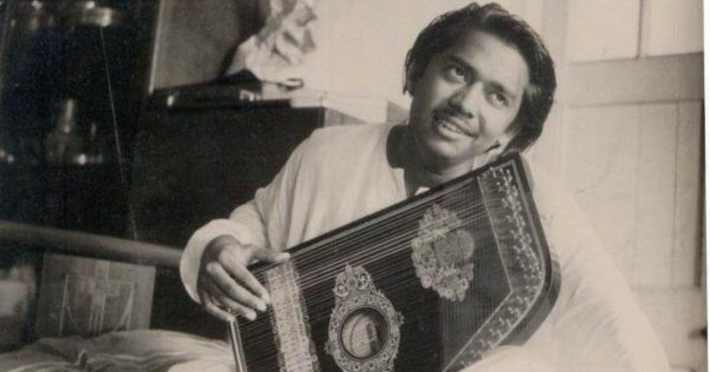
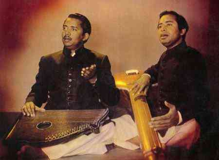
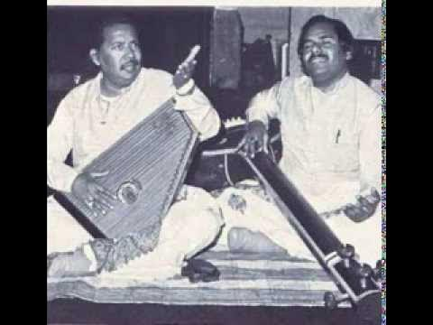

# Ustad Salamat Ali Khan (1934 - 2001)

## Contents
1. Khayal and Tarana

<figure>
  
  <figcaption><i>Ustad Salamat Ali Khan Saheb in young age, with his Swarmandal</i></figcaption>
   
</figure>

<figure>
  
  <figcaption><i>Ustad Nazakat Salamat Ali Khan Saheb, image from an LP record cover</i></figcaption>
   
</figure>

<figure>
  
  <figcaption><i>Ustad Salamat Ali, with son Sharafat Ali Khan</i></figcaption>
</figure>

## 1. Khayal and Tarana

| Raag          | Thaat   | Record                                       | About Record (Runtime, Type, Year, Place, Live)                                     | By                                                | Accompaniments                                 |
| ------------- | ------- | -------------------------------------------- | ----------------------------------------------------------------------------------- | ------------------------------------------------- | ---------------------------------------------- |
| Abhogi        | Kafi    | [Youtube](https://www.youtube.com/watch?v=3_0VldEenVU) | Runtime: 34min; Type: Khayal, Tarana                                                | Ustad Salamat Ali Khan and Ustad Nazakat Ali Khan |
| Abhogi        | Kafi    | [Youtube](https://www.youtube.com/watch?v=oi2rvjtRBjA) | Runtime: 120min; Type: Khayal, Tarana                                               | Ustad Salamat Ali Khan and Ustad Nazakat Ali Khan |
| Abhogi Kanada | Kafi    | [Youtube](https://www.youtube.com/watch?v=2gFjxlbLM6o) | Runtime: 41min; Type: Khayal, Tarana; Year: 1991; Live                              | Ustad Salamat Ali Khan & Ustad Sharafat Ali Khan  | Sarangi: Asif Khan; Tabla: Manmohan Singh      |
| Abhogi Kanada | Kafi    | [Youtube](https://www.youtube.com/watch?v=pNrj5lAn56s) | Runtime: 40min; Type: Khayal, Tarana; Place: Afganistan                             | Ustad Salamat Ali Khan and Ustad Nazakat Ali Khan |
| Abhogi Kanada | Kafi    | [Youtube](https://www.youtube.com/watch?v=yeZ9UJnIEXk) | Runtime: 59min; Type: Khayal, Tarana                                                | Ustad Salamat Ali Khan & Ustad Sharafat Ali Khan  | Sarangi: Allah Rakha; Tabla: Ghulam Abbas      |
| Abhogi Kanhra | Kafi    | [Youtube](https://www.youtube.com/watch?v=JobD0znjLCs) | Runtime: 34min; Type: Khayal, Tarana                                                | Ustad Salamat Ali Khan and Ustad Nazakat Ali Khan | Sarangi: Zahoori Khan; Tabla: Allah Ditta Khan |
| Adana         | Asavari | [Youtube](https://www.youtube.com/watch?v=cAT2zFC1UXY) | Runtime: 100min; Type: Khayal, Tarana                                               | Ustad Salamat Ali Khan and Ustad Nazakat Ali Khan |
| Adana         | Asavari | [Youtube](https://www.youtube.com/watch?v=Hnw3BF08xSk) | Runtime: 33min; Type: Khayal, Tarana; Place: Varanasi; Year: 1950s                  | Ustad Salamat Ali Khan and Ustad Nazakat Ali Khan | Tabla: Pt Anokhelal                            |
| Adana         | Asavari | [Youtube](https://www.youtube.com/watch?v=kzpySlZY_gg) | Runtime: 14min; Type: Khayal, Tarana                                                | Ustad Salamat Ali Khan and Ustad Nazakat Ali Khan | Sarangi: Nathoo Khan; Tabla: Allah Ditta       |
| Adana         | Asavari | [Youtube](https://www.youtube.com/watch?v=mWIX5sbfPdM) | Runtime: 30min(Starts: 1:37:00); Type: Khayal, Tarana; Place: Varanasi; Year: 1960s | Ustad Salamat Ali Khan and Ustad Nazakat Ali Khan |
